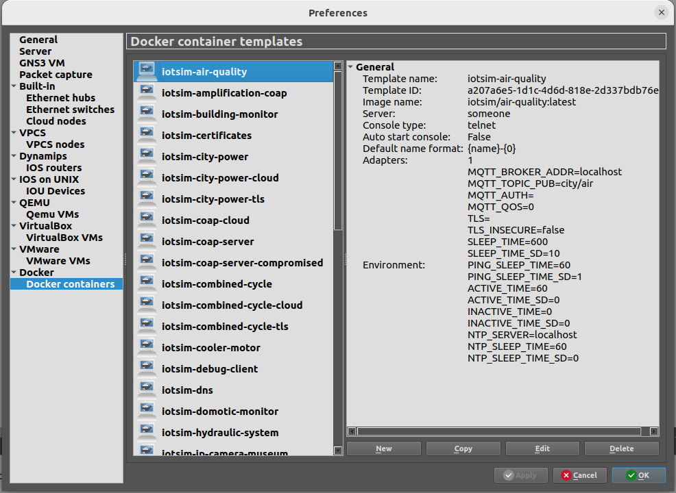
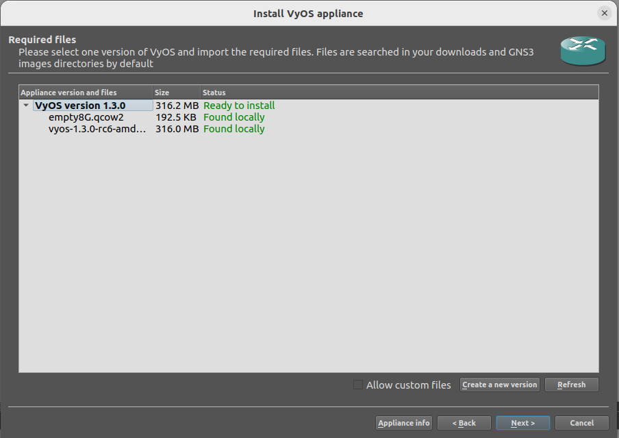
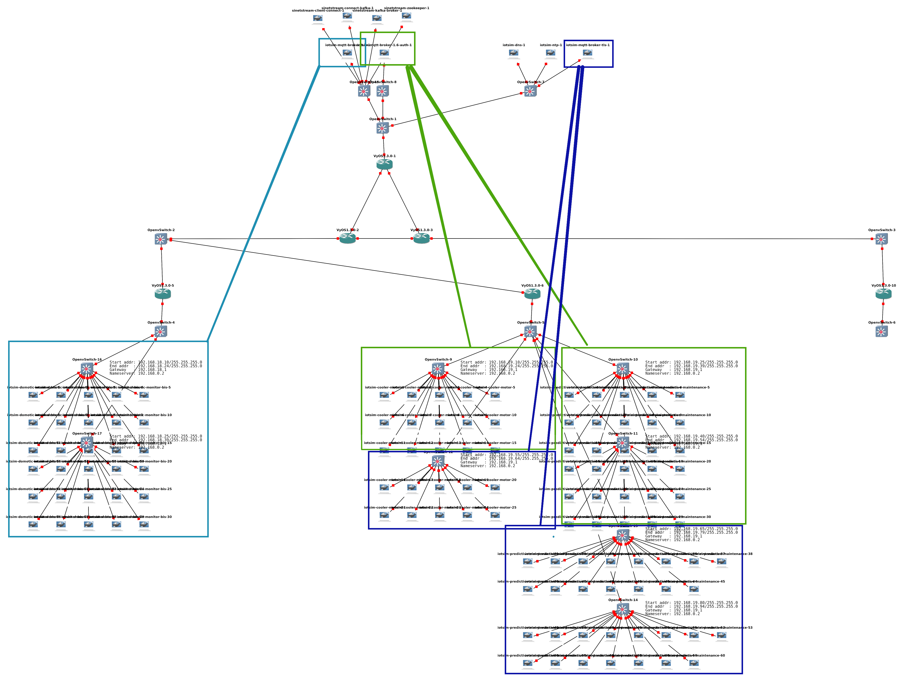
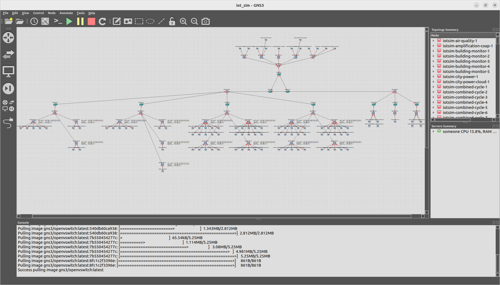

# SINETStream testbed: Reproducible IoT Testbed for Security Experiments and Dataset Generation (MQTT and Kafka traffic)

This repository is a fork from [PekeDevil Gotham Testbed](https://github.com/PekeDevil/gotham-iot-testbed) (X. Sáez-de-Cámara, J. L. Flores, C. Arellano, A. Urbieta and U. Zurutuza, "Gotham Testbed: A Reproducible IoT Testbed for Security Experiments and Dataset Generation," in IEEE Transactions on Dependable and Secure Computing, doi: 10.1109/TDSC.2023.3247166)

It contains improved and extended source code of the cyber-range (or testbed) called Gotham. 
Details about this extended testbed can be found in the paper [Cyber-range for customizable IoT dataset with legitimate and attack traffic](to pbe published)

If you use or build upon this testbed, please consider citing the article.


Tested on Ubuntu 20.04.4 LTS, 22.04 LTS and fedora 35

## 1 Install

Read [the install.sh script](./install.sh) to see commands for installation.
Some commands in `install.sh` only work with Linux distributions using `apt-get`.
Adapt accordingly if your distribution uses another package manager.

### 1.1 Install packages `make wget python3 konsole python3X-venv`
```bash
$ ./install.sh packages
```
### 1.2  Install gns3 (server and gui)
- Answer 'Yes' when the Wireshark installer asks 'Should non-superusers be able to capture packets?'
```bash
$ ./install.sh gns3
```
### 1.3 (Re)Install docker
```bash
$ ./install.sh docker
```
### 1.4 Add user to the required groups `ubridge libvirt docker`
```bash
$ ./install.sh groups
```
If the user is not correctly added to the groups, restart the machine.

### 1.4 notes

- For large topologies with many nodes (containers, VMs) you might need to increase the maximum number of open file descriptors (in the machine running GNS3) to start all the nodes simultaneously. 
  - Check the current limit with `ulimit -n`
  - Increase the current limit (to 2048 e.g.) with `ulimit -n 2048`

- KVM virtualization support. When running GNS3 in a virtual machine, enable nested virtualization.

---

## 2 Python virtual environment

Create a Python virtual environment to install the Python dependencies of the project (requires the `python3X-venv` package). To interact with the project, activate the virtual environment.

Inside the project's repository directory, run:

```
$ python3 -m venv venv
$ source venv/bin/activate
(venv) $ pip install -r requirements.txt
```

## 3 Template creation

- If you want to build and run the **SINETStream** topology, follow instructions about **Alternative A** 
- If you want to build and run the **Gotham** topology, follow instructions about **Alternative B** 
- Some instructions must be followed regardless of the chosen topology (marked with `Alternative A and B`).
- We do not guarantee good execution of Gotham related code (Alternative B)

### 3.1 Build Docker images

All the Dockerfiles and the dependencies that describe the emulated nodes (IoT devices, servers, attackers) are inside the `./Dockerfiles` directory. The build process of some Docker images depend on other images; instead of building them manually, the project includes a `Makefile` to automate the process.

#### 3.1 Alternative A: SINETStream topology
Build necessary docker images with
```bash
$ make sinetstream
```

#### 3.1 Alternative B: Gotham topology
Run `make` to automatically build all the Docker images in the correct order:
```
$ make
```
Currently `make` alone fails with

```text
docker build --file Dockerfiles/malware/Mirai/Dockerfile.builder --tag iotsim/mirai-builder Dockerfiles/malware/Mirai
[...]
Step 5/25 : RUN git clone https://github.com/jgamblin/Mirai-Source-Code.git
 ---> Using cache
 ---> fb4b9797e4ee
Step 6/25 : RUN mkdir go &&    go get github.com/go-sql-driver/mysql &&    go get github.com/mattn/go-shellwords
 ---> Running in 0739859c03c6
# filippo.io/edwards25519
go/src/filippo.io/edwards25519/scalar.go:166:53: cannot convert x (type []byte) to type *[32]byte
The command '/bin/sh -c mkdir go &&    go get github.com/go-sql-driver/mysql &&    go get github.com/mattn/go-shellwords' returned a non-zero code: 2
make: *** [Makefile:81: buildstatus/Mirai_builder] Error 2

```

### notes
This `make` can take a long time (approx 30 min depending on the host and network speed); you can parallelize the build process running make with the `-j` flag.

If you modify any Dockerfile, configuration file, program or any other file inside the `./Dockerfiles` directory, run `make` again. It will rebuild the updated images and other images that depend on them.

## 4.1 start gns3
Open GNS3, the GNS3 server must be running.
- (Optional) If you want the graphical user interface (gui) run. 
This runs both gns3server and the gns3 client.
```bash
$ gns3
```
- If you don't need the graphical user interface (gui) run
```bash
$ gns3server
```

## 5 Templates creation

### 5.1 Docker templates creation
Inside the `./src` directory run:
```
(venv) $ python3 create_templates.py
```
### 5.2 verify the created templates
You can verify the created templates in GNS3 select: Edit > Preferences > Docker containers



### 5.3 Create router template (manually with gui or automatically without gui)

Inside the project's repository directory (`gotham-iot-testbed`), run:
```bash
make vyosiso
```

The artifacts (a .iso file and a .qcow2 file) will be downloaded into the `~/Downloads directory`. 

#### Option1: Create router template manually
Follow the instructions to import appliances in GNS3 https://docs.gns3.com/docs/using-gns3/beginners/import-gns3-appliance/. The router appliance file is located at `./router/iotsim-vyos.gns3a`.



#### Option2: Create router template automatically without gui

Inside the project's repository directory (`gotham-iot-testbed`), run
```bash
(venv) $ ./install_import_appliance.sh
```
Inside the `src` directory, run:
```bash
(venv) $ python3 create_templates.py vyos_template
```

## 6 Topology builder

GNS3 must be running.

#### 6.1 Alternative A: SINETStream (and MQTTSet) topology

- Optional: in [config_sinetstream.py](./src/config_sinetstream.py), choose a project name 

You can choose among various pre-configured topologies of different sizes.

| type of topology  | description                                        | composition                                 |
|-------------------|----------------------------------------------------|---------------------------------------------|
| sinetstream_small | recommended to get familiar with GothX             | 14 sensors, 3 MQTT brokers, 1 Kafka broker  | 
| sinetstream_big   | it is the topology represented on the image bellow | 115 sensors, 3 MQTT brokers, 1 Kafka broker |
| sinetstream_max   | maximum GothX topology without code modification   | 450 sensors, 3 MQTT brokers, 1 Kafka broker |
| mqttset           | topology used to reproduce MQTTSet `*`             | 10 sensors, 1 MQTT brokers                  |

`*` to reproduce MQTTSet [see this other instructions file](./README_MQTTSet.md).

- run a preconfigured tologoly (here `sinetstream_big`)

```bash
(venv) $ python3 create_topology_sinetstream.py sinetstream_big
```

Image shows topology `sinetstream_big` on GNS3 Graphical Interface


#### 6.1 Alternative B: Gotham topology

Inside the `./src` directory run:
```bash
(venv) $ python3 create_topology_gotham.py
```



## 7 Scenario execution

GNS3 must be running.

#### 7.1 Alternative A: SINETStream topology

Inside the `src/` directory :

- in [config_sinetstream.py](./src/config_sinetstream.py), choose settings about the legitimate and malicious traffic that will be generated 
- run the scenario
```bash
(venv) $ python3 run_scenario_sinetstream.py
```

#### 7.1 Alternative B: Gotham topology

Inside the `src/` directory, run the scenario

```
(venv) $ python3 run_scenario_gotham.py
```

#### Possible HTTP error 409 Client Error 

You may need to **restart your user session to refresh user permissions**, in case you encounter error like one of the following

```text
uBridge is not available, path doesn't exist, or you just installed GNS3 and need to restart your user session to refresh user permissions.
```
or

```text
Traceback (most recent call last):
  File "~/gotham-iot-testbed/venv_gotham/lib/python3.12/site-packages/gns3fy/gns3fy.py", line 141, in http_call
    _response.raise_for_status()
  File "~/gotham-iot-testbed/venv_gotham/lib/python3.12/site-packages/requests/models.py", line 1024, in raise_for_status
    raise HTTPError(http_error_msg, response=self)
requests.exceptions.HTTPError: 409 Client Error: Conflict for url: http://localhost:3080/v2/projects/7666c9a4-ddc1-41e5-8c3d-5f235bd18073/nodes/faeece40-a02c-450c-8870-d7766b29b3bd/start
```
